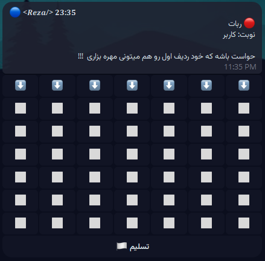

# 🎮 Rez4InARowBot - Connect Four Telegram Bot 🤖

Welcome to **Rez4InARowBot**, a fun and interactive Telegram bot that brings the classic **Connect Four** game to your chats! 🎲 Whether you want to challenge the bot in single-player mode or face off against a friend in multiplayer mode, this bot has you covered. With a sleek 7x7 board, strategic gameplay, and a leaderboard to track top players, it’s time to drop some pieces and aim for four in a row! 🏆

---

## 🚀 Features

- **Single-Player Mode** 🎮:
  - Play against the bot with three difficulty levels: **Easy 😊**, **Medium 😎**, and **Hard 😈**.
  - The bot uses a **minimax algorithm** for the hard difficulty, making it a real challenge!
  - Earn points based on difficulty: 1 for Easy, 3 for Medium, and 10 for Hard.

- **Multiplayer Mode** 👥:
  - Challenge a friend in any Telegram chat (group or private) using inline queries.
  - Each player has **10 seconds** per turn to keep the game fast-paced.
  - Rematch option to keep the fun going! 🔄

- **Leaderboard** 🏅:
  - Tracks top players based on points earned in single-player mode.
  - Displayed with names and usernames for bragging rights!

- **Admin Features** 🔧:
  - Admins can send **broadcast messages** to all users.
  - Configurable admin IDs via environment variables.

- **Rate Limiting** ⏳:
  - Prevents spam with a limit of 3 messages per second; exceeding this triggers a 30-second cooldown.
  - Ensures fair usage for all players.

- **Persian Support** 🇮🇷:
  - Fully localized in Persian with emoji-rich messages for a fun experience.
  - Timezone-aware (Asia/Tehran) for accurate timestamps.

- **Database Integration** 💾:
  - Stores user data and leaderboard scores in a SQLite database.
  - Ensures persistent tracking of scores and user profiles.

- **Error Handling & Logging** 📜:
  - Robust logging with colored terminal output for errors and critical messages.
  - Helps developers debug issues quickly.

---

## 📋 Requirements

To run **Rez4InARowBot**, you’ll need:

- **Python 3.8+** 🐍
- **Dependencies** (listed in `requirements.txt`):
  - `pyTelegramBotAPI` - For Telegram bot functionality.
  - `python-dotenv` - For loading environment variables.
  - `colorama` - For colored terminal logs.
  - `sqlite3` - For database operations (included with Python).

- **Environment Variables**:
  - Create a `.env` file with the following:
    ```
    TOKEN=your_telegram_bot_token
    ADMIN_USER_IDS=comma_separated_admin_user_ids
    ```
  - Obtain your `TOKEN` from [BotFather](https://t.me/BotFather) on Telegram.

---

## 🛠 Installation

Follow these steps to set up the bot locally:

1. **Clone the Repository**:
   ```bash
   git clone https://github.com/ItsReZNuM/4InARowTelBot
   cd 4InARowTelBot
   ```

2. **Install Dependencies**:
   ```bash
   pip install -r requirements.txt
   ```

3. **Set Up Environment Variables**:
   - Create a `.env` file in the project root.
   - Add your Telegram bot token and admin user IDs:
     ```
     TOKEN=your_bot_token_here
     ADMIN_USER_IDS=123456789,987654321
     ```

4. **Run the Bot**:
   ```bash
   python main.py
   ```

5. **Interact with the Bot**:
   - Open Telegram, find your bot (e.g., `@Rez4InARowBot`), and send `/start` to begin!

---

## 📂 Project Structure

The project is organized for clarity and modularity:

```
Rez4InARowBot/
│
├── handlers/
│   ├── callbacks.py     # Handles inline button callbacks (game moves, difficulty, etc.)
│   ├── commands.py      # Handles Telegram commands (/start, /help, etc.)
│   ├── inline.py        # Handles inline queries for multiplayer mode
│
├── config.py            # Configuration (logging, env variables, bot token)
├── database.py          # SQLite database setup and operations
├── game_logic.py        # Core game logic (board, moves, AI, rendering)
├── main.py              # Bot initialization and polling
├── utils.py             # Utility functions (rate limiting, timestamp validation)
├── .env                 # Environment variables (not tracked in git)
├── requirements.txt     # Python dependencies
└── README.md            # This file
```

---

## 🎲 How to Play

### Single-Player Mode
1. Send `/start` to the bot.
2. Click **“شروع بازی”** and choose a difficulty (**Easy**, **Medium**, or **Hard**).
3. Drop your pieces (🔵) by clicking the top-row buttons (⬇️).
4. The bot (🔴) responds based on the difficulty:
   - **Easy**: Random moves.
   - **Medium**: Blocks wins and seeks winning moves.
   - **Hard**: Uses minimax algorithm for strategic play.
5. Win by aligning **four pieces** horizontally, vertically, or diagonally!
6. Earn points and climb the **leaderboard** with `/leaderboard`.

### Multiplayer Mode
1. In a group or private chat, type `@Rez4InARowBot` and select **“شروع بازی دو نفره”**.
2. Another player clicks **“پایه‌م!”** to join.
3. Take turns dropping pieces (🔵 for player 1, 🔴 for player 2) within **10 seconds**.
4. Win by getting **four in a row** or agree to a rematch if it’s a draw!

### Commands
- `/start`: Start the bot and show the main menu.
- `/help`: Display game instructions.
- `/leaderboard`: View top 5 players.
- `/alive`: Check if the bot is running.

---

## 🖼 Screenshots

Here’s a glimpse of **Rez4InARowBot** in action! 🎮



---

## 🛠 Technical Details

- **Game Board**: A 7x7 grid where players drop pieces into columns.
- **AI Logic**: The bot’s “Hard” mode uses a **minimax algorithm** with a depth of 5 to evaluate moves.
- **Database**: SQLite with two tables:
  - `users`: Stores `user_id`, `username`, and `first_name`.
  - `leaderboard`: Tracks `user_id`, `first_name`, and `score`.
- **Rate Limiting**: Limits users to 3 messages per second; exceeding triggers a 30-second block.
- **Logging**: Errors and critical messages are logged to the terminal with colored output using `colorama`.

---

## 🤝 Contributing

We welcome contributions to make **Rez4InARowBot** even better! 🙌

1. Fork the repository.
2. Create a feature branch (`git checkout -b feature/your-feature`).
3. Commit your changes (`git commit -m "Add your feature"`).
4. Push to the branch (`git push origin feature/your-feature`).
5. Open a pull request.

Please ensure your code follows the existing style and includes appropriate tests.

---

## 📬 Contact

Got questions, suggestions, or issues? Reach out to us!

- **Telegram**: [@ItsReZNuM](https://t.me/ItsReZNuM)
- **Email**: rmohamadnia85@gmail.com
- **GitHub Issues**: [Open an issue](https://github.com/ItsReZNuM/4InARowTelBot/issues)

---


🌟 **Drop a piece, have some fun, and aim for four in a row!** 🎮

---

**Made with ❤️ by ItsReZNuM**